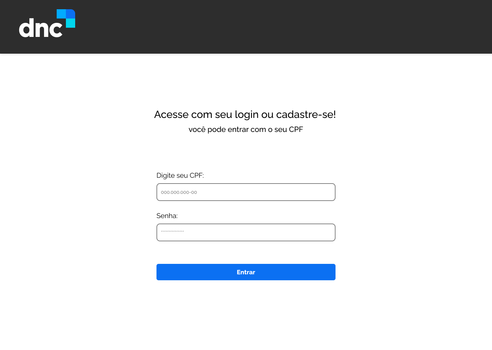
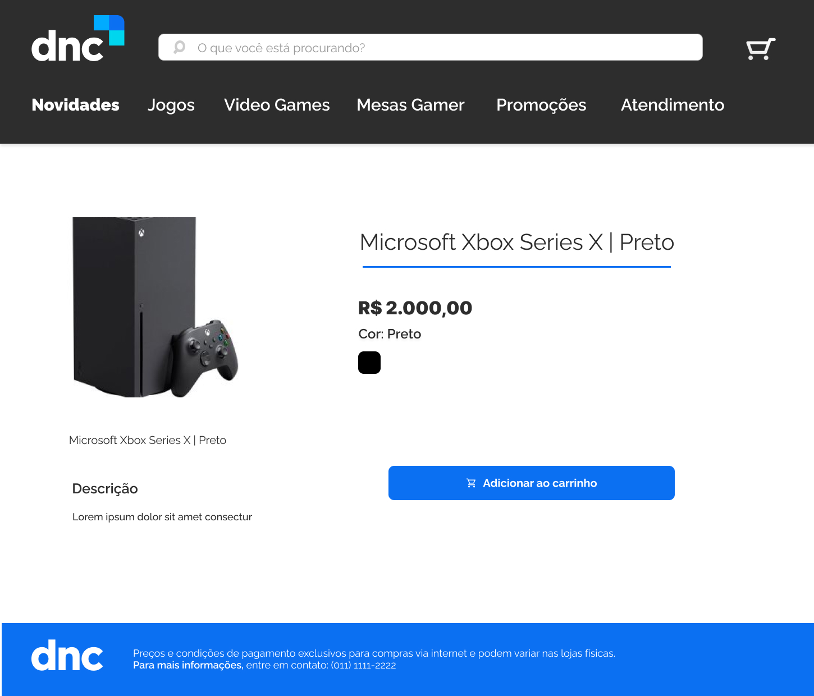
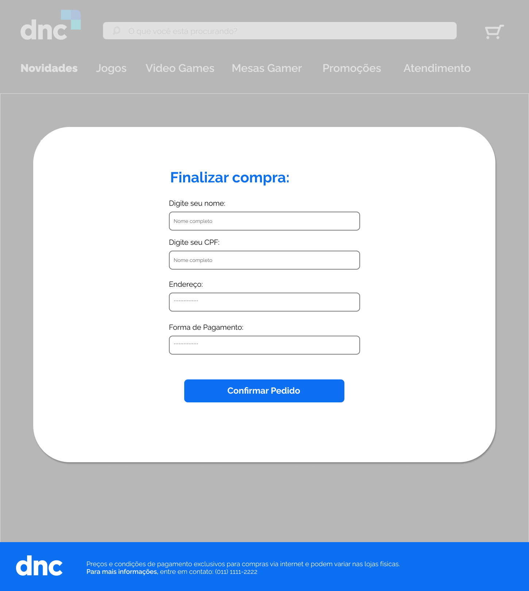

<p align="center">
  
</p>

# 
<h1 align="center">
  Projeto E-commerce: DNC Store 🛍️ 
</h1>

## Sobre o projeto

Este é um projeto de e-commerce desenvolvido pelos alunos do grupo 07 do curso TECH 1 da [Escola DNC](https://www.escoladnc.com.br/). O objetivo do projeto é criar uma loja online para venda de produtos, relacionados à área de game, criado em [React.JS](https://react.dev/) utilizando o framework [Vite](https://vitejs.dev/).
Criamos o design da aplicação seguindo o [Figma](https://www.figma.com/file/sR8p251TiovX0RMWvXW0zX/Projeto-em-Grupo---DNC?node-id=0%3A1&t=gXBkrVRxcBEVV4iW-0) fornecido pela DNC.


## Tecnologias utilizadas 

**Stacks:** React, HTML5, SASS, React Router, Mock (Simulador de Banco de Dados).


## Executar localmente
Você precisará ter instalado o [Node.js](https://nodejs.org/en) para utilizar comandos npm e o [Git](https://git-scm.com/) instalado na sua máquina.

Clone o projeto:

```bash
  git clone https://github.com/netoeac/g7-ecommerce-dnc.git
```

Navegue até o diretório do projeto:

```bash
  cd g7-ecommerce-dnc
```

Instale as dependências:

```bash
  npm install
```

Inicie o servidor the server:

```bash
  npm run dev
```


## Views & Componentes

- <b>Login:</b>
 A view Login é a página inicial, responsável pela autenticação, utilizamos a biblioteca `react-imask` para adicionar a máscara de CPF no input e a validação com alertas usando o `sweetalert2` para informar o usuário de um possível campo em branco.

- <b>Home:</b>
A view Home é a página principal do site, contendo a lista dos produtos ofertados, bem como uma estilização de um banner atrativo ao usuário. A view é composta pelos componentes padrões Navbar e Footer e os componentes Banner e ProductsCard. A view Home recebe o parâmetro data e o desestrutura para popular o componente ProductsCard, recebendo os parâmetros de Id e Produto. 

- <b>Banner:</b>
Utilizamos a biblioteca [SwiperJS](https://swiperjs.com/) para a criação dos banners interativos com scroll automático e com o mouse do usuário.

- <b>ProductsCard:</b>
O componente ProductsCard é utilizado dentro da view Home para renderizar cada um dos cards dos produtos de forma escalável, ou seja, o mesmo componente é utilizado para cada um dos parâmetros de forma dinâmica. O componente recebe as informações do produto e renderiza sua imagem, nome e possui um link de redirecionamento para mais detalhes de um produto em específico, levando a view de Products.


- <b>Register & Payment Modal:</b>
O modal foi desenvolvido com a função de demonstrar em uma janela separada o produto separado e sua descrição detalhada. Para o usuário verificar especificamente o produto antes de prosseguir com a compra ou voltar para o menu principal. 
O modal foi construído de forma dinâmica para conseguir alterar os produtos de acordo com a usabilidade de cada usuário.


## Aprendizados no projeto

Aprendemos que trabalhar em equipe em um mesmo projeto, requer padrões a serem seguidos antes mesmo de começar a codificar. É importante estar acordado entre a equipe o padrão de criação de variáveis, o idioma para a criação de arquivos e estrutura do projeto (optamos pelo inglês por ser o padrão mais adotado),  padrão de estruturação de pastas e quais tecnologias e bibliotecas utilizar.


## Otimizações

Estamos trabalhando na versão responsiva para utilização em dispositivos móveis.


## Autores
Esse projeto foi desenvolvido por:
- [ID 84664 - Adriano Avelar da Silva](https://www.github.com/Adriano-Avelar)
- [ID 55224 - Elias Alves de Carvalho Neto](https://www.github.com/netoeac)
- [ID 83427 - Enrique Santos Bernardo](https://github.com/EnriqueBernardo)
- [ID 84963 - Fabricio Castilhano Bontadini](https://www.github.com/FabricioBontadini)
- [ID 43198 - Igor Oliveira de Sousa](https://www.github.com/OliverSouw)
- [ID 2389 - Murilo Moreti Romão](https://www.github.com/MuriloRomao)
- [ID 71847 - Kleber Coelho](https://www.github.com/KleberMayC)

## Screenshots

<br>
<br>
<br>
<br>


